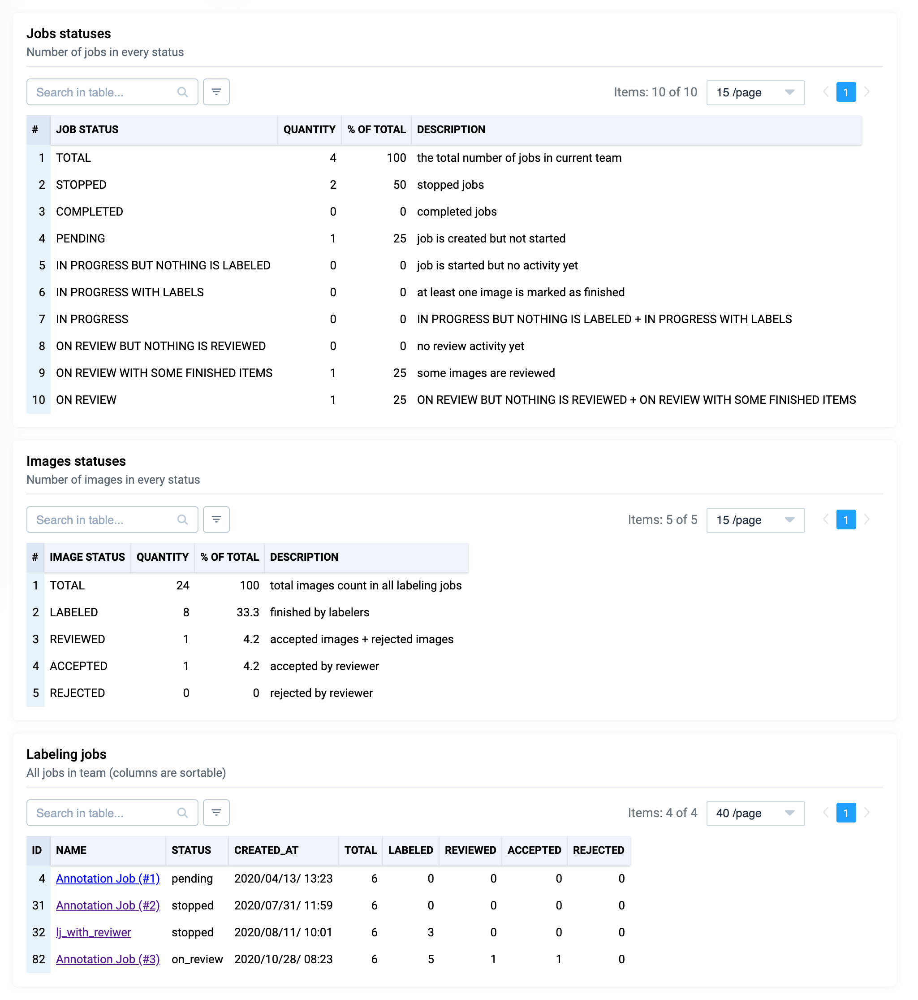
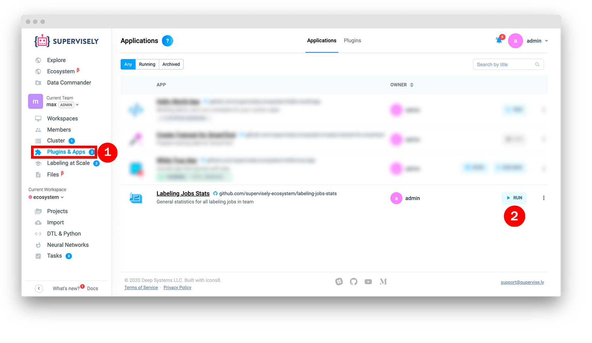
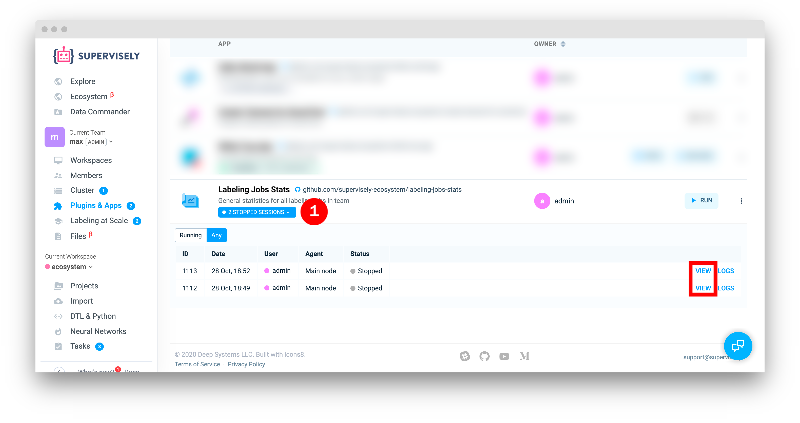

# Labeling Jobs Stats

  <a href="#Overview">Overview</a> •
  <a href="#How-To-Run">How To Run</a> •
  <a href="#History-Of-Runs">History of runs</a>

## Overview

Report provides both high-level and detailed statistics for all labeling jobs in a team.

## How To Run

### Step 1: Run from context menu of project

Add app from ecosystem. Go to `Apps` page and press `Run` button.

## History of runs

To see history of runs go to `Apps` page, click to applications sessions. In front of every session you can see buttons (`View` and `Logs`). Press `View` button to open stopped application session in `Read Only` mode.

